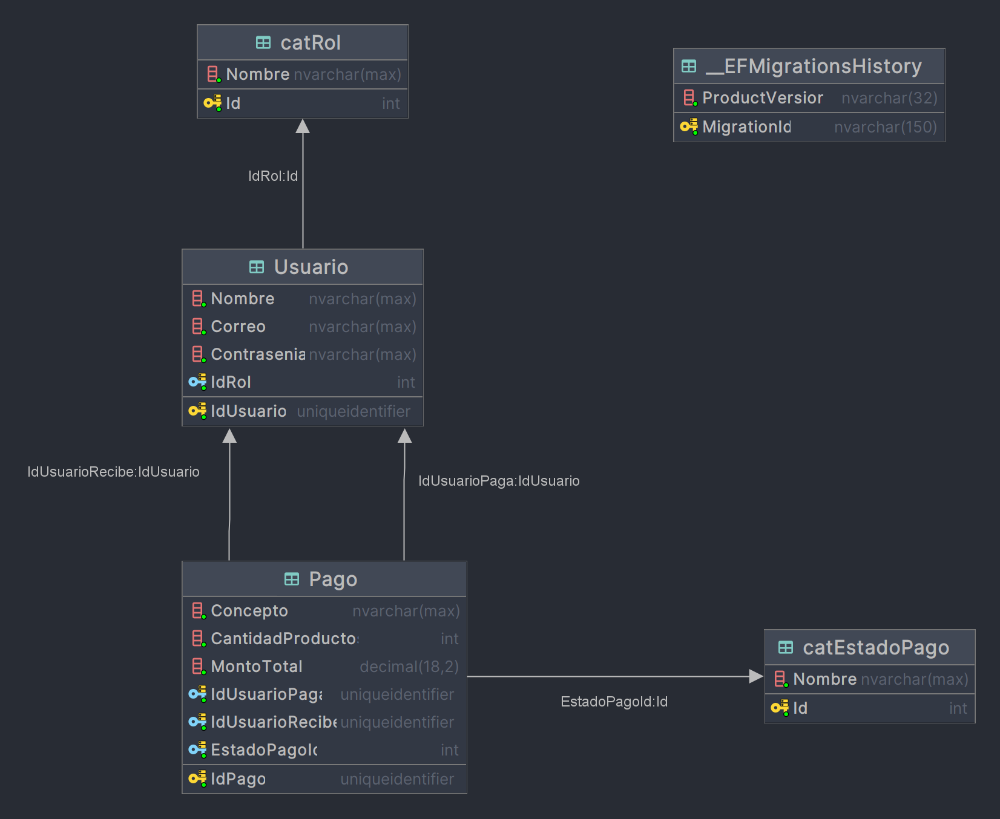
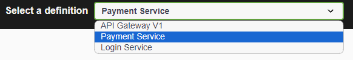

# Payment Code Challenge

Este proyecto es una solución basada en microservicios para gestionar pagos y autenticaciones utilizando .NET 8, Docker y una arquitectura escalable. Los servicios están diseñados para ejecutarse de manera independiente y comunicarse entre sí a través de un API Gateway.

## Estructura del Proyecto

El proyecto se compone de los siguientes microservicios:

- **ApiGateway**: Maneja las solicitudes entrantes y las distribuye a los microservicios correspondientes.
- **PaymentService**: Encargado de la gestión de los pagos, incluyendo la creación y actualización de estados de pago.
- **LoginService**: Gestiona la autenticación de usuarios y la emisión de tokens JWT.
- **Database**: Implementa la base de datos SQL Server donde se almacenan los datos.

### Comunicación entre Microservicios

1. **ApiGateway** actúa como un punto de entrada único para todas las solicitudes, redirigiendo las mismas a `PaymentService` y `LoginService` según corresponda.
2. **PaymentService** y **LoginService** se comunican con la **Database** para almacenar y recuperar información.
3. Todos los microservicios se ejecutan en contenedores Docker y están configurados para comunicarse a través de una red Docker compartida.

### Enfoque Code First para la Base de Datos

Este proyecto utiliza el enfoque Code First con Entity Framework. Esto significa que las entidades del modelo de datos se definen en código, y las migraciones se utilizan para generar y actualizar la estructura de la base de datos.

- **Migraciones**: Las migraciones de Entity Framework permiten aplicar cambios al esquema de la base de datos a medida que evoluciona el modelo de datos.
- **Entidades**: Las entidades como `Usuario`, `Pago`, `catRol`, y `catEstadoPago` están mapeadas a tablas en la base de datos.

### Esquema de la Base de Datos

El esquema de la base de datos incluye las siguientes tablas:

- **catRol**: Almacena los roles de usuario, como "Admin" y "Usuario". Esta tabla se relaciona con la tabla `Usuario` a través de una clave foránea (`IdRol`), lo que permite asignar roles específicos a cada usuario.
- **Usuario**: Almacena los datos de los usuarios, incluyendo su correo electrónico, contraseña, y el rol asignado (`IdRol`).
- **Pago**: Almacena los datos de los pagos, incluyendo el concepto, la cantidad de productos, el monto total, y los usuarios involucrados en el pago (`IdUsuarioPaga`, `IdUsuarioRecibe`). También incluye el estado del pago (`EstadoPagoId`), que se relaciona con la tabla `catEstadoPago`.
- **catEstadoPago**: Almacena los posibles estados de un pago, como "Registrado", "En proceso", "Pagado", y "Cancelado".

Las relaciones entre estas tablas están definidas por claves foráneas, y la base de datos se gestiona a través del microservicio `Database`.

### Usuarios Creados por Defecto

Al iniciar el proyecto, se crean los siguientes usuarios por defecto en la base de datos. Estos usuarios son necesarios para autenticar las peticiones a través del `LoginService` y para validar permisos en `PaymentService`.

| Nombre                | Correo               | Contraseña        | Rol    |
|-----------------------|----------------------|-------------------|--------|
| Admin User            | admin@example.com    | adminpassword     | Admin  |
| John Doe              | user1@example.com    | user1password     | Usuario |
| Jane Doe              | user2@example.com    | user2password     | Usuario |
| Bob Smith             | user3@example.com    | user3password     | Usuario |

Utiliza estas credenciales, incluyendo los nombres, para autenticarte en el sistema y obtener tokens JWT para realizar solicitudes a los servicios.

## Configuración de la Red Docker

Los contenedores se configuran utilizando Docker Compose, que define dos redes principales:

- **services**: Red utilizada para la comunicación entre los servicios (ApiGateway, PaymentService, LoginService).
- **database**: Red utilizada para la comunicación entre los servicios y la base de datos.

Cada servicio se comunica a través de nombres de host definidos en el archivo `docker-compose.yml`, lo que permite la resolución de nombres entre contenedores.

## Patrones de Diseño Utilizados

### 1. Repository Pattern

**Descripción**: El patrón de repositorio proporciona una abstracción sobre la capa de acceso a datos, facilitando la separación de preocupaciones. En lugar de interactuar directamente con la base de datos, los servicios consumen repositorios, que manejan la lógica CRUD (Create, Read, Update, Delete).

**Beneficios**:
- **Separación de la lógica de negocio**: Permite mantener la lógica de negocio aislada de la lógica de acceso a datos.
- **Fácil de probar**: Al utilizar interfaces, los repositorios pueden ser fácilmente reemplazados por implementaciones simuladas (mocks) durante las pruebas.
- **Mantenimiento**: Facilita los cambios en la lógica de acceso a datos sin afectar otras partes del sistema.

**Implementación en el proyecto**:
- `IPaymentRepository` y `IUserRepository` son interfaces que definen las operaciones de acceso a datos para los pagos y los usuarios, respectivamente.
- Las clases `PaymentRepository` y `UserRepository` implementan estas interfaces, proporcionando la lógica específica para interactuar con Entity Framework.

### 2. Dependency Injection (DI)

**Descripción**: La inyección de dependencias es un patrón de diseño que permite a un objeto recibir otras dependencias en lugar de crearlas por sí mismo. Esto se logra utilizando un contenedor de inyección de dependencias (como el que ofrece .NET Core).

**Beneficios**:
- **Desacoplamiento**: Fomenta un código más modular al desacoplar las dependencias de la lógica de negocio.
- **Facilidad de prueba**: Facilita la inyección de dependencias simuladas o alternativas durante las pruebas.
- **Flexibilidad**: Permite cambiar las implementaciones de las dependencias sin modificar las clases consumidoras.

**Implementación en el proyecto**:
- Los servicios (`IPaymentService`, `ILogService`) y repositorios (`IPaymentRepository`, `IUserRepository`) se registran en el contenedor de DI en `Program.cs`, y se inyectan en los controladores y otros servicios a través de sus constructores.

### 3. DTO (Data Transfer Object) Pattern

**Descripción**: Los DTOs son objetos que transportan datos entre diferentes capas de la aplicación. Se utilizan para encapsular y transportar datos entre la capa de presentación, la capa de negocio y la capa de acceso a datos.

**Beneficios**:
- **Encapsulamiento de datos**: Los DTOs permiten transportar solo los datos necesarios, lo que reduce el acoplamiento entre capas.
- **Seguridad**: Al no exponer directamente las entidades del modelo, se reduce el riesgo de filtración de información sensible.
- **Facilidad de mapeo**: Facilita el mapeo entre diferentes modelos de datos (por ejemplo, entre el modelo de base de datos y el modelo de vista).

**Implementación en el proyecto**:
- Se utilizan DTOs como `PaymentDTO` y `LoginDTO` para transportar datos entre los controladores y los servicios. Estos DTOs encapsulan los datos necesarios para las operaciones de negocio sin exponer directamente las entidades del modelo de datos.

### 4. Microservices Architecture

**Descripción**: La arquitectura de microservicios organiza una aplicación como una colección de servicios pequeños, autónomos y que se comunican entre sí a través de API. Cada microservicio es independiente y se encarga de una funcionalidad específica del negocio.

**Beneficios**:
- **Escalabilidad**: Cada microservicio puede escalarse de manera independiente según sus necesidades.
- **Desarrollo Independiente**: Permite a diferentes equipos trabajar en diferentes microservicios de manera autónoma.
- **Resiliencia**: Si un microservicio falla, no necesariamente afecta a otros, lo que mejora la resiliencia del sistema.

**Implementación en el proyecto**:
- El proyecto está dividido en varios microservicios: `ApiGateway`, `PaymentService`, `LoginService`, y `Database`.
- Cada microservicio se ejecuta en su propio contenedor Docker y se comunica con otros servicios a través de HTTP (utilizando el API Gateway) o a través de conexiones directas a la base de datos.

## Uso de Swagger para Probar las APIs

Cada microservicio tiene su propia interfaz Swagger para la documentación y pruebas de API. Además, se ha configurado un Swagger centralizado en el **API Gateway**, que agrupa las definiciones de los diferentes servicios. Puedes seleccionar la definición del servicio que deseas probar desde un menú desplegable.

### Ejemplo de selección de definición en Swagger:

En el **API Gateway**, simplemente selecciona la definición correspondiente al servicio (`PaymentService` o `LoginService`) desde el menú desplegable para interactuar con sus endpoints.

## Requisitos Previos

- [.NET 8 SDK](https://dotnet.microsoft.com/download/dotnet/8.0)
- [Docker](https://www.docker.com/get-started)
- [Docker Compose](https://docs.docker.com/compose/)

### Acceso a los Servicios

- **API Gateway**: `http://localhost:5000`
    - **PaymentService**: `http://localhost:5000/payment`
    - **LoginService**: `http://localhost:5000/login`

- **PaymentService**: Directamente en `http://localhost:8080`
- **LoginService**: Directamente en `http://localhost:8081`

### Autenticación y Autorización

Los endpoints de los servicios están protegidos con autenticación JWT. Debes obtener un token JWT a través de `LoginService` y luego incluirlo en el encabezado `Authorization` de tus solicitudes para acceder a los endpoints protegidos.
